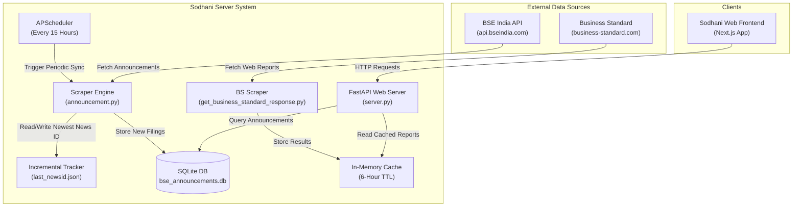

# Sodhani Server Architecture & Overview

This document provides a clear, high-level overview of the `sodhani-server` system, including its directory structure, system architecture, data workflows, and API endpoints.

---

## 📁 File Structure

```
sodhani-server/
├── server.py                        # Main FastAPI web server & background scheduler entry point
├── announcement.py                  # Core BSE India scraper and SQLite persistence layer
├── get_business_standard_response.py # Web scraper for Business Standard brokerage research reports
├── seed.py                          # One-time manual script to populate announcement database
├── bse_announcements.db             # Local SQLite database (stores announcements & indexes)
├── last_newsid.json                 # Tracker file storing the newest processed BSE news ID
├── requirements.txt                 # Python dependency declarations
├── pyproject.toml                   # Project metadata & environment specification
├── Procfile                         # Process manager config for Railway deployment
├── railway-works.md                 # Deployment steps & commands for Railway hosting
├── summary.md                       # Quick reference summary of server decisions
└── architecture.md                  # This architecture and system design document
```

---

## 🏗️ System Architecture

`sodhani-server` is built as a lightweight, high-performance Python application using **FastAPI**, **SQLite**, and **APScheduler**.



---

## 🔄 Core Workflows

### 1. Incremental BSE Announcement Sync
To keep compute and network usage minimal, the server fetches data incrementally:
1. **Trigger**: `APScheduler` runs `scheduled_fetch()` periodically (every 15 hours) or via `POST /admin/fetch`.
2. **Read High-Water Mark**: Checks `last_newsid.json` for the last processed announcement ID.
3. **Fetch & Paginate**: Requests announcement pages from the BSE API.
4. **Early Termination**: As soon as a record matching `last_newsid` is found, fetching stops immediately.
5. **Database Commit**: Inserts new records into SQLite using `INSERT OR IGNORE` and updates `last_newsid.json`.

### 2. Brokerage Research Reports with TTL Caching
1. Client requests `GET /api/research-reports?days=15`.
2. Server checks `_research_reports_cache` for a fresh payload within the TTL window (default 6 hours).
3. If valid cached data exists, it returns immediately without hitting external servers.
4. If cache is expired or empty, it scrapes Business Standard HTML, parses report tables using `BeautifulSoup4`, filters by date, updates the cache, and returns the response.

---

## 🔌 API Endpoint Reference

| Method | Endpoint | Description | Query Parameters |
| :--- | :--- | :--- | :--- |
| `GET` | `/health` | Server health & liveness check | None |
| `GET` | `/api/announcements` | Retrieve recent global BSE announcements | `limit` (default: 5, max: 100) |
| `GET` | `/api/announcements/{scrip_cd}` | Retrieve BSE announcements for a specific company code | `scrip_cd` (path), `limit` (default: 5), `offset` (default: 0) |
| `GET` | `/api/research-reports` | Retrieve brokerage research reports & target prices | `days` (default: 15, range: 0-90) |
| `GET` | `/api/equity` | Serve static equity JSON report files | `code` (required), `consolidated` (default: false) |
| `POST` | `/admin/fetch` | Trigger a manual BSE announcement fetch for today | None |

### Sample Responses

#### `GET /health`
```json
{
  "status": "ok"
}
```

#### `GET /api/announcements/500325`
```json
{
  "total": 42,
  "announcements": [
    {
      "newsid": "a4d8...",
      "scrip_cd": "500325",
      "news_dt": "2026-07-24T10:00:00",
      "newssub": "Financial Results",
      "headline": "Outcome of Board Meeting",
      "slongname": "RELIANCE INDUSTRIES LTD.",
      "announcement_type": "C",
      "attachmentname": "...",
      "categoryname": "Company Update"
    }
  ]
}
```

---

## 🚀 Deployment (Railway)

- **Platform**: Railway.app
- **Runtime**: Python 3.13
- **Persistent Volume**: Mounted at `/data` (`DATA_DIR=/data`) to preserve `bse_announcements.db` and `last_newsid.json`.
- **Process Entry**: `uvicorn server:app --host 0.0.0.0 --port ${PORT:-8000}`
